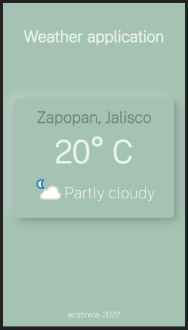

# weather-jsapp

Weather application built with vanilla JavaScript. 

## JavaScript concepts

In this application, I implemented some JavaScript concepts like:

### Asynchronism

The weather details come from [Open Weather Map API](https://rapidapi.com/community/api/open-weather-map)
When the application loads, it tries to get the user's location to show the weather details. If the user does not accept to share the location, the application shows the weather details from Zapopan, Jalisco.

### Geolocation

To retrieve user's location, the application uses [Geolocation API](https://developer.mozilla.org/en-US/docs/Web/API/Geolocation_API)

### Callbacks

A callback function is a function passed to another function as an argument. Geolocation API requires this feature.